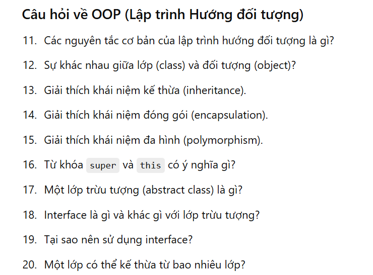
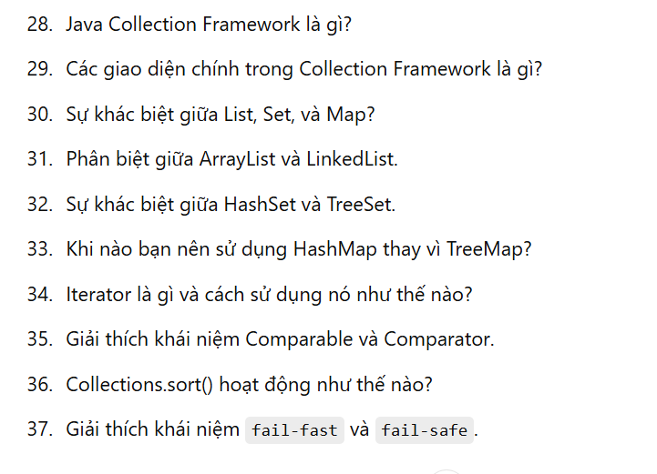
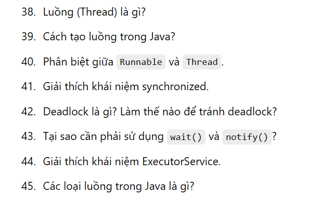
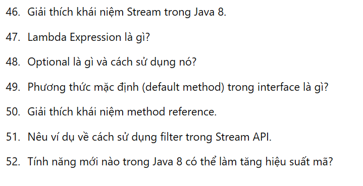
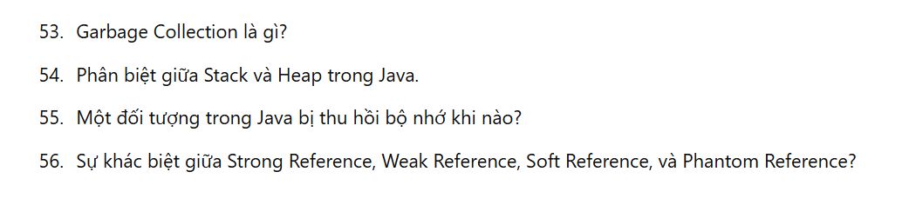
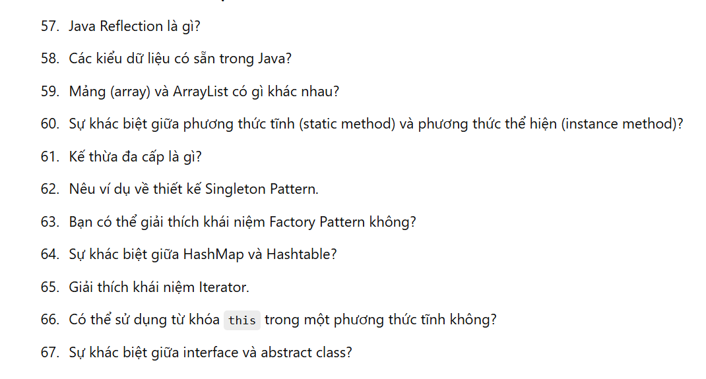
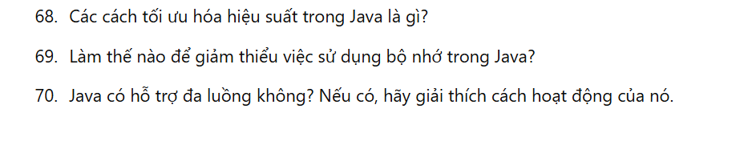
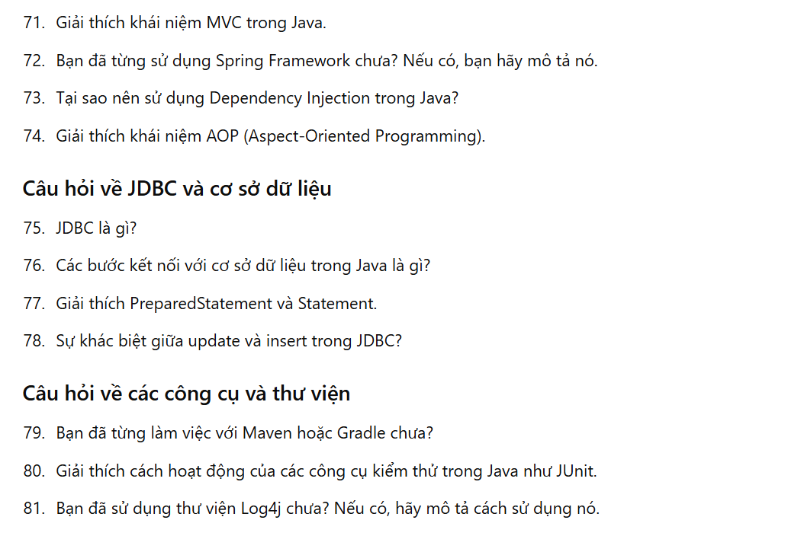
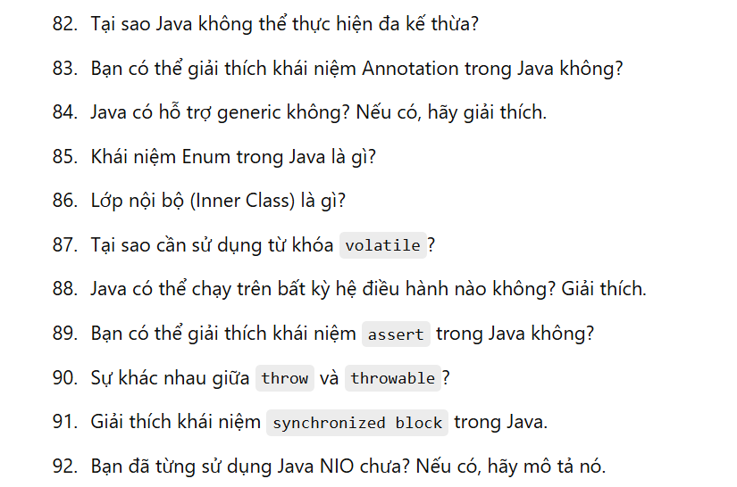
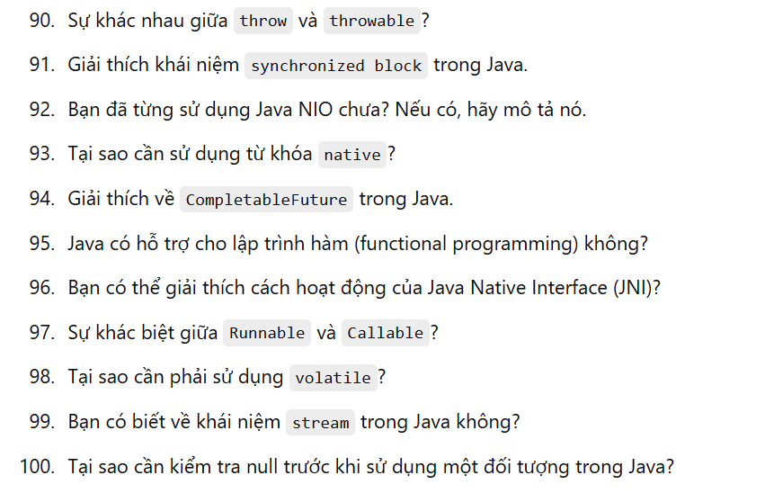

# Java_knowledge
Review Java Knowledge

100 câu hỏi java 

tôi cần tìm hiểu về JDK 

## Câu hỏi về OOP (Lập trình Hướng đối tượng)

## Câu hỏi về xử lý ngoại lệ

## Câu hỏi về Collection Framework

## Câu hỏi về luồng (Threads) và xử lý đồng thời

## Câu hỏi về Java 8 và các tính năng mới

## Câu hỏi về memory management

## Câu hỏi về các khái niệm khác

## Câu hỏi về performance

## Câu hỏi về thiết kế

## Câu hỏi khác

