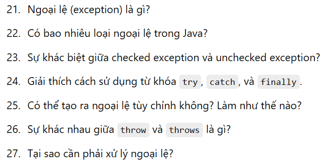

# Java_knowledge
Review Java Knowledge

100 câu hỏi java 

###  Q1
- JDK là công cụ cần thiết cho bất kỳ ai muốn phát triển ứng dụng Java, cung cấp tất cả những gì bạn cần để viết, biên dịch, và chạy mã Java. (JDK 8, JDK 11, và JDK 17)
- JDK bao gồm JRE (Java Runtime Environment), JVM , thư viện chuẩn để thao tác với api java 
- thư viện chuân như Java Collections: ArrayList, HashSet, HashMap, Java I/O, Java Networking, Java Concurrency: Thread, Runnable, ExecutorService, CountDownLatch
- Java Util: Date, Calendar
### Q2 
- có, vì có khái niệm đối tươgnj: object, class, định nghĩa thuộc tính, hành vi 
- 1 tính đóng gói Encapsulation: cho phép lập trình viên che dấu thông tin bên trong đối tượng
- 2 tính kế thừa Inheritance: cho phép kế thừa từ các lớp khác, sử dụng lại mã
- 3 Tính đa hình (Polymorphism)
- 4 Tính trừu tượng (Abstraction)

## Câu hỏi về OOP (Lập trình Hướng đối tượng)

## Câu hỏi về xử lý ngoại lệ

## Câu hỏi về Collection Framework

## Câu hỏi về luồng (Threads) và xử lý đồng thời

## Câu hỏi về Java 8 và các tính năng mới

## Câu hỏi về memory management

## Câu hỏi về các khái niệm khác

## Câu hỏi về performance

## Câu hỏi về thiết kế

## Câu hỏi khác

